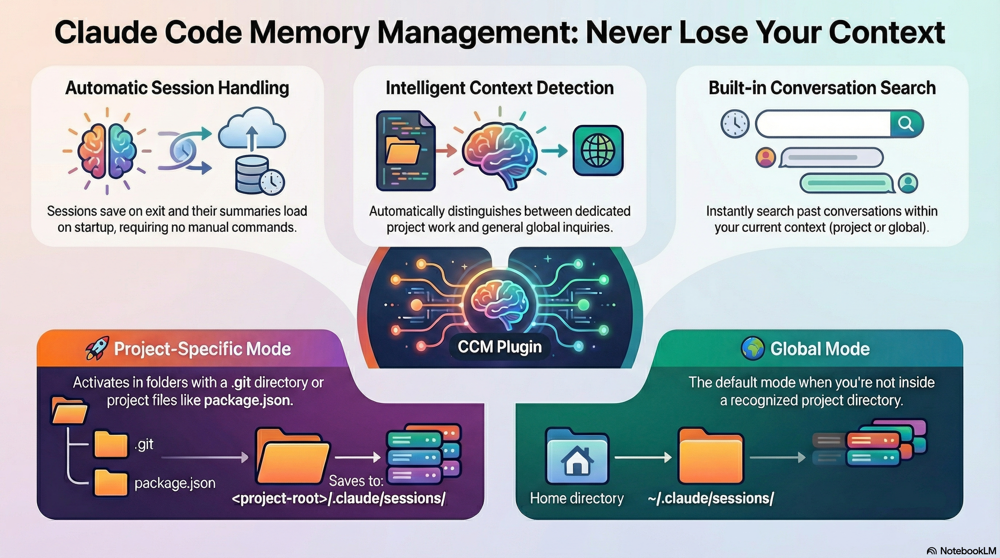

# Claude Code Memory Management (CCM)




Context-aware session management for Claude Code. Automatically save conversations, load summaries on startup, and search past sessions with intelligent project-specific or global context detection.

## Features

- 🔄 **Auto-save**: Sessions automatically saved when you exit Claude Code
- 📋 **Auto-load**: Latest summary displayed at session start
- 🎯 **Context-aware**: Detects project vs global context automatically
- 🔍 **Search**: Search past conversations in current context
- 📁 **Organized**: Clean directory structure per project
- 🚀 **Zero dependencies**: Pure Node.js, no installation required

## How It Works

**Plugin Location (Global):** `~/.claude/plugins/ccm` (installed once, works everywhere)

**Session Storage (Automatic):** CCM detects your working directory and saves sessions accordingly:

```
Plugin (global):           ~/.claude/plugins/ccm/
                                    |
                                    v
                          [Automatic Detection]
                                    |
                    +---------------+---------------+
                    |                               |
            In a project?                    Outside projects?
                    |                               |
                    v                               v
        <project>/.claude/sessions/        ~/.claude/sessions/
        (project-specific)                   (global)
```

CCM automatically adapts to your working context:

### 🚀 Project-Specific Mode (Claude Project)
**Activated when:** You're in a directory with a `.claude` folder (anywhere in the parent tree)

When you initialize Claude Code in a directory (via `/init` or manually creating `.claude/`), that becomes a **Claude project**. CCM will store all sessions for that project and its subdirectories in one place.

**Session location:** `<claude-project-root>/.claude/sessions/`

**Key behavior:**
- All subdirectories within a Claude project share the same session storage
- Example: If `/Users/you/Documents/.claude/` exists, all work in Documents or its subdirectories (like `Documents/workspace/project-a/`) will save sessions to `/Users/you/Documents/.claude/sessions/`
- This aligns with Claude Code's concept of a "project" - any directory where you've initialized Claude

**Use for:**
- Dedicated Claude project work
- Maintaining separate context per project
- Sharing session context across related subdirectories
- Team collaboration (optional sharing via git)

### 🌍 Global Mode
**Activated when:** You're not in a directory with `.claude` anywhere in the parent tree

**Session location:** `~/.claude/sessions/`

**Use for:**
- Quick questions outside projects
- Learning and experimentation
- General non-project work

## Installation

**Important:** The plugin itself installs globally, but it automatically manages sessions per-project or globally based on your working directory.

### Step 1: Clone the Repository

```bash
# Clone to a local directory (anywhere you like)
git clone https://github.com/rexzhen/ccm ~/ccm-plugin
# or
git clone https://github.com/rexzhen/ccm ~/Documents/plugins/ccm
```

### Step 2: Add as a Marketplace

```bash
# Add the plugin as a local marketplace
claude plugin marketplace add ~/ccm-plugin
# or wherever you cloned it
```

### Step 3: Install the Plugin

```bash
# Install ccm from the marketplace
claude plugin install ccm
```

That's it! The plugin is now active. Session storage location is determined automatically:
- **In a project directory:** Sessions saved to `<project>/.claude/sessions/`
- **Outside projects:** Sessions saved to `~/.claude/sessions/`

### Verification

```bash
# List installed plugins
claude plugin list

# You should see ccm in the list
```

### Alternative: GitHub Marketplace (Coming Soon)

Once published to a public marketplace, users will be able to install with a single command:

```bash
# Future: Direct installation from GitHub
claude plugin marketplace add rexzhen/ccm
claude plugin install ccm
```

## Usage

### Automatic Operation (Recommended)

CCM works automatically without commands:

1. **Session Start**: Summary from last session automatically appears
2. **During Work**: Continue conversation normally
3. **Session End**: Session automatically saved when you exit

### Manual Commands

#### View Session Context
```bash
/ccm-info
```
Shows current mode (project/global), session directory, and project details.

#### Manual Save
```bash
/ccm-save
/ccm-save "Completed authentication feature"
```
Manually save session with optional custom message.

#### Search Sessions
```bash
/ccm-search "authentication"
/ccm-search "bug fix"
```
Search past sessions in current context for specific topics.

#### List Recent Sessions
```bash
/ccm-list
/ccm-list 20
```
List recent sessions (default: 10 most recent).

## How Plugin vs Session Storage Works

### Plugin Installation (One-Time, Global):
```bash
# Install plugin once
git clone https://github.com/rexzhen/ccm ~/.claude/plugins/ccm

# Now CCM is available in ALL Claude Code sessions
```

### Session Storage (Automatic Per Context):
```bash
# Working on Project A
cd ~/projects/project-a
claude
# Plugin loaded from: ~/.claude/plugins/ccm/
# Sessions saved to:   ~/projects/project-a/.claude/sessions/

# Working on Project B
cd ~/projects/project-b
claude
# Plugin loaded from: ~/.claude/plugins/ccm/ (same plugin)
# Sessions saved to:   ~/projects/project-b/.claude/sessions/ (different location!)

# Quick question (not in a project)
cd ~
claude
# Plugin loaded from: ~/.claude/plugins/ccm/ (same plugin)
# Sessions saved to:   ~/.claude/sessions/ (global location)
```

**Key Point:** One plugin installation, automatic context detection!

## Examples

### Scenario 1: Multiple Projects

```bash
# Working on Project A
cd ~/projects/project-a
claude
# 📁 Sessions: ~/projects/project-a/.claude/sessions/
# Shows: Last conversation about Project A

# Switch to Project B
cd ~/projects/project-b
claude
# 📁 Sessions: ~/projects/project-b/.claude/sessions/
# Shows: Last conversation about Project B

# Quick question outside projects
cd ~
claude
# 🌍 Sessions: ~/.claude/sessions/
# Shows: Last global conversation
```

### Scenario 2: Search Within Context

```bash
# In project-a
/ccm-search "database migration"
# Searches only project-a sessions

# In project-b
/ccm-search "database migration"
# Searches only project-b sessions (different results!)
```

### Scenario 3: Check Your Context

```bash
/ccm-info

# Output:
## Current Session Context

**Mode:** 🚀 Project-specific
**Session Directory:** `/Users/you/projects/api/.claude/sessions`
**Project Root:** `/Users/you/projects/api`
**Project Name:** api
**Git Repository:** Yes ✓
```

## Directory Structure

### Project-Specific Sessions
```
your-project/
├── .claude/
│   └── sessions/
│       ├── 2026-01-31T14-30-22-000Z.json
│       ├── 2026-01-30T09-15-34-000Z.json
│       ├── summaries/
│       │   ├── latest.md
│       │   ├── 2026-01-31.md
│       │   └── 2026-01-30.md
│       └── archives/
└── .gitignore  # Add .claude/sessions/ here
```

### Global Sessions
```
~/.claude/
└── sessions/
    ├── 2026-01-31T14-30-22-000Z.json
    ├── summaries/
    │   └── latest.md
    └── archives/
```

## Configuration

### .gitignore Setup

**Keep sessions private (recommended):**
```gitignore
# In project root .gitignore
.claude/sessions/
```

**Share summaries with team (optional):**
```gitignore
# Keep full sessions private
.claude/sessions/*.json

# Allow summaries to be committed
!.claude/sessions/summaries/
```

### Customize Hooks

Edit `hooks/hooks.json` to customize auto-save behavior:

```json
{
  "hooks": {
    "SessionEnd": [
      {
        "type": "command",
        "command": "node ${PLUGIN_DIR}/scripts/session-manager.js save"
      }
    ]
  }
}
```

### Direct Script Usage

You can also use the session manager directly:

```bash
# Load latest summary
node ~/.claude/plugins/ccm/scripts/session-manager.js load

# Save session manually
node ~/.claude/plugins/ccm/scripts/session-manager.js save "Custom message"

# Search sessions
node ~/.claude/plugins/ccm/scripts/session-manager.js search "query"

# Show context info
node ~/.claude/plugins/ccm/scripts/session-manager.js info

# List sessions
node ~/.claude/plugins/ccm/scripts/session-manager.js list 20
```

## Requirements

- **Node.js**: 14.0.0 or higher (usually pre-installed on developer machines)
- **Claude Code**: Latest version with plugin support
- **Operating System**: macOS, Linux, or Windows

## Plugin Structure

```
ccm/
├── .claude-plugin/
│   └── plugin.json          # Plugin manifest
├── skills/
│   ├── ccm-load/            # Auto-load summary skill
│   ├── ccm-save/            # Manual save skill
│   ├── ccm-search/          # Search sessions skill
│   ├── ccm-info/            # Context info skill
│   └── ccm-list/            # List sessions skill
├── hooks/
│   └── hooks.json           # Auto-save on session end
├── scripts/
│   └── session-manager.js   # Core session management logic
├── package.json
└── README.md
```

## Troubleshooting

### Sessions Not Auto-Loading

Check that the skill is enabled:
```bash
/ccm-info
```

### Sessions Saving to Wrong Location

Verify project detection:
```bash
/ccm-info
```

If you want project-specific sessions but CCM is using global mode:
- Create a `.claude` directory in your project root (or run `/init`) to mark it as a Claude project
- CCM only uses the `.claude` directory to detect Claude projects, not software project markers like `.git` or `package.json`

### Search Not Finding Sessions

Remember: Search is context-aware and only searches current context (project or global).

### Permission Errors

Ensure directories are writable:
```bash
chmod -R u+w ~/.claude/sessions
# or for project
chmod -R u+w ./.claude/sessions
```

## Advanced Usage

### Custom Session Data

You can extend session data by modifying `session-manager.js`:

```javascript
const sessionData = {
  summary: 'Custom summary',
  filesModified: ['src/app.js', 'test/app.test.js'],
  topics: ['authentication', 'testing'],
  // Add your custom fields
};
manager.saveSession(sessionData);
```

### Multi-Profile Support

Set environment variable for different profiles:

```bash
# Use different profiles for different types of work
CCM_PROFILE=experimental claude
CCM_PROFILE=production claude
```

## Contributing

Contributions are welcome! Please:

1. Fork the repository
2. Create a feature branch (`git checkout -b feature/amazing-feature`)
3. Commit your changes (`git commit -m 'Add amazing feature'`)
4. Push to the branch (`git push origin feature/amazing-feature`)
5. Open a Pull Request

## License

MIT License - see [LICENSE](LICENSE) file for details

## Author

Rex Zhen

## Changelog

### v1.0.1 (2026-01-31)
- Fixed: Simplified project detection to only use `.claude` directory (Claude projects)
- Improved: Session manager now correctly handles Claude project hierarchy
- Changed: Removed confusion between software projects (.git, package.json) and Claude projects
- All subdirectories within a Claude project now share the same session storage

### v1.0.0 (2026-01-31)
- Initial release
- Context-aware session management
- Auto-save and auto-load functionality
- Search and list commands
- Project-specific and global session support

## Support

- Issues: https://github.com/rexzhen/ccm/issues
- Documentation: https://github.com/rexzhen/ccm/wiki

## Acknowledgments

- Built for [Claude Code](https://claude.ai/code)
- Inspired by the need for better conversation continuity across sessions
